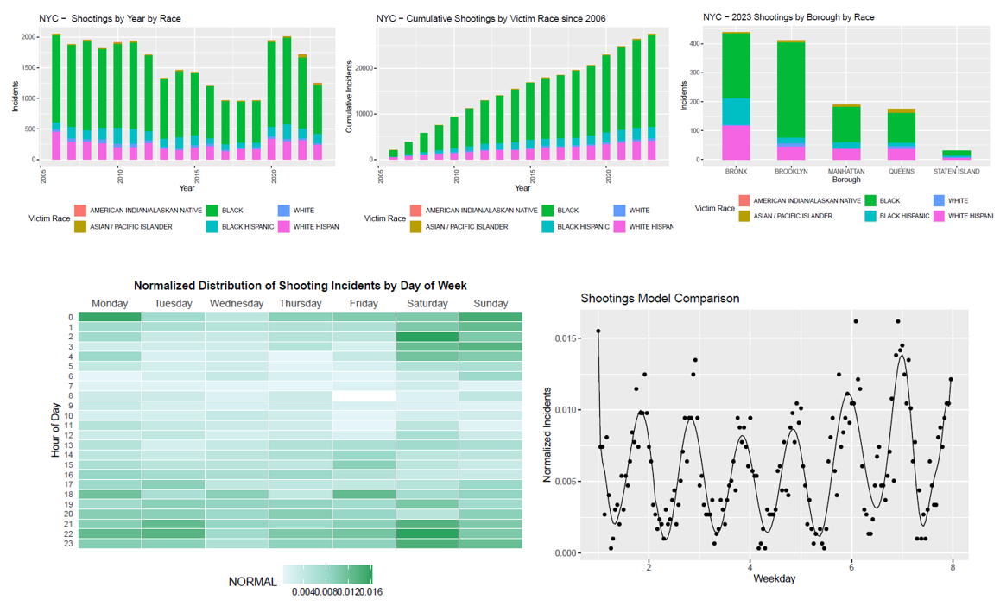

# NYC-Shootings
Project from DTSA5301 Course to analyze shooting incidents in NYC from 2006 to 2023. The analysis considers incidents over time, victim demographics, and time of incident throughout the week. Below are some visualizations created for the project, highlighting race disparities and polynomial model of incident reports.

